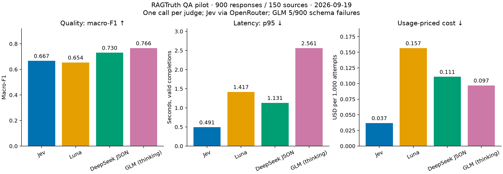
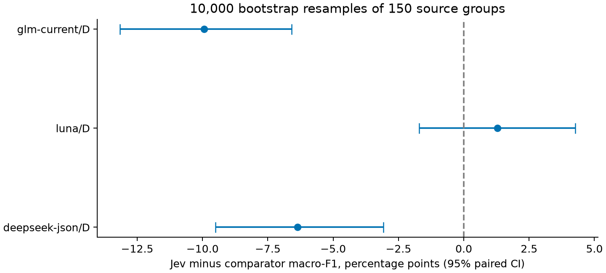

# RAGTruth results

On September 19, 2026, four judge configurations evaluated all 900 official QA test responses from 150 source groups. The 3,600 requests took 23.4 minutes. Their recorded token usage cost $0.361134 at the published rates.

Jev was the cheapest and fastest configuration. DeepSeek and GLM had higher macro-F1. Their additional cost was small in absolute terms: GLM cost about **six cents more per 1,000 evaluations** than Jev. Luna did not establish better quality than Jev on this cohort. The comparison covers one dataset and one measurement session.

Jev uses native Noul decisions. The three LLM judges generate a final JSON label: Luna uses strict JSON Schema, while DeepSeek and GLM use JSON object mode with local schema validation. Each evaluation is one call, with no application-defined intermediate reasoning steps. `D` denotes a generated label; `P` denotes Jev's native probability, thresholded at 0.5.

## Quality, latency and cost

`yes` means the answer contains an unsupported or conflicting factual assertion. Gold labels: 740 `no`, 160 `yes`. All predictions and failures are counted; no answer repair or retry was used.

| Configuration | Accuracy | Macro-F1 | Missed unsupported / 160 | False alarms / 740 clean | Invalid / 900 | p50, s | p95, s | USD / 1,000 attempts |
|---|---:|---:|---:|---:|---:|---:|---:|---:|
| Jev native P | 72.00% | 0.6667 | 16 | 236 | 0 | 0.330 | 0.491 | 0.0369 |
| Luna D | 71.11% | 0.6539 | 23 | 237 | 0 | 0.781 | 1.417 | 0.1566 |
| DeepSeek GA JSON D | 80.44% | 0.7303 | 34 | 142 | 0 | 0.879 | 1.131 | 0.1108 |
| GLM D, forced thinking | 83.22% | 0.7661 | 25 | 121 | 5 | 1.404 | 2.561 | 0.0970 |

Latency columns cover valid completions. GLM's failure-aware all-attempt p95 estimate is 2.654 s; its five invalid responses are not treated as successful fast judgments. No timeouts occurred. Network, provider serving, serialization and response validation are included; scheduling gaps between requests are excluded. Jev uses OpenRouter; others use first-party APIs. This is one client-network measurement session, not a model-only inference or deployment-time benchmark.

**Accuracy alone is misleading:** always predicting `no` would reach 82.22% accuracy but miss all 160 unsupported answers and achieve only 0.4512 macro-F1. Every primary judge exceeded that macro-F1 baseline. Jev caught 90% of unsupported answers but incorrectly flagged 31.9% of clean answers. GLM caught 82.5%, falsely flagged 16.4% of clean answers, and had five format failures. These are different error trade-offs, not a universal winner.



## Is the difference statistically clear?

Paired bootstrap: 10,000 resamples of the **150 source groups**, preserving the six answers per source. The following are differences in macro-F1, in percentage points, **Jev minus comparator**:

| Comparator | Difference | 95% paired interval |
|---|---:|---:|
| DeepSeek | −6.36 | [−9.51, −3.07] |
| GLM | −9.94 | [−13.16, −6.59] |
| Luna | +1.28 | [−1.71, +4.26] |

The DeepSeek/GLM quality gaps are clear on this dataset; the Jev–Luna superiority difference is inconclusive. Cost and latency ratios are observed operating points, without cross-session uncertainty or repeated-run evidence.



## Configuration and pricing

Prices verified **2026-09-19**, USD per million tokens. Exact requests, returned identities, API options, usage and rate sources are in [models.json](models.json), [metrics.json](metrics.json) and the raw archive. Reasoning tokens already included in output usage are not charged twice.

| System / provider | Request ID → returned ID | Configuration | Input / cached / output |
|---|---|---|---|
| Jev / OpenRouter → TypeSafe | `typesafe/jev-1.13` → `typesafe/jev-1.13-20260917` | Native Noul, one P call; alpha Decisions API | 0.042 / unspecified / 0 |
| Luna / OpenAI | `gpt-5.6-luna` → same | Responses strict JSON schema, reasoning `none`, temperature 0, max output 512, store false | 0.20 / 0.02 / 1.20; cache writes 0.25 |
| DeepSeek / DeepSeek | `deepseek-flash` → same | GA JSON object, thinking disabled, temperature 0, max output 512 | Off-peak 0.15 / 0.003 / 0.60 |
| GLM / Z.ai | `glm-5.3-flash` → same | JSON object, thinking enabled, effort low, sampling disabled, max output 4096 | 0.15 / 0.03 / 0.50 |

Rate sources: [OpenRouter Jev](https://openrouter.ai/typesafe/jev-1.13), [OpenAI](https://developers.openai.com/api/docs/pricing), [DeepSeek](https://api-docs.deepseek.com/quick_start/pricing/), [Z.ai](https://docs.z.ai/guides/overview/pricing). DeepSeek ran on Saturday at the off-peak tariff. Aliases are not immutable snapshots except Jev's captured returned revision.

| System | Input tokens | Output tokens | Exposed reasoning tokens | Cached input tokens | Total USD |
|---|---:|---:|---:|---:|---:|
| Jev | 790,140 | 19,800 | Not exposed | Not exposed | 0.03318588 |
| Luna | 625,233 | 12,600 | 0 | 0 | 0.14092785 |
| DeepSeek | 630,915 | 9,281 | Not exposed | 3,200 | 0.09973545 |
| GLM | 659,058 | 32,102 | 22,490 | 230,208 | 0.08728474 |

Luna additionally exposed 15,225 cache-write tokens. Costs use actual exposed usage and published tariffs; they are not invoice-confirmed charges. Jev's reported request costs agree with its tariff estimate. Provider prefix caching was not disabled, so cache savings are part of these observed configurations; repriced scenarios are separately recorded. No application result cache was used.

## Failure cases and limitations

- `rag:13464` is labelled clean by RAGTruth; the weather summary closely tracks the supplied passages. Jev assigns p(unsupported)=0.92 and rejects it, while all three LLMs accept it. In total, 47 examples have Jev wrong and all three LLMs right under the reference labels.
- `rag:12917` generalizes an oven drawer's purpose even though the evidence says it varies by model. Jev flags the annotated conflict; all three LLMs miss it. There are five examples where only Jev agrees with the reference.
- `rag:12435` assigns a fact to passages 2 and 3 although the annotation says only passage 3 supports it. All four judges miss this labelled conflict. Correct general content does not guarantee correct source attribution.
- `rag:14765` is marked unsupported, but another supplied passage appears to support the contested inference. All four accept it. We retain the original human label and disclose the apparent inconsistency; no outcome-driven relabelling was performed.
- GLM failed validation on 5/900 responses: wrong key, extra key, trailing backtick, or prose appended after JSON. These count as failures. Raw responses are preserved.
- DeepSeek beta strict D had 505/538 invalid outputs in the earlier [development snapshot](../development-sanity/). It was excluded before this pilot's test run; the working GA JSON mode is the DeepSeek comparator. These development failures are separate from the pilot quality estimates.

All four models passed the initial 60-case sanity gate with valid outputs, both predicted classes, and accuracy between zero and one. The remaining 840 cases then ran once, with the same rubric and human reference labels. Cohort size was fixed before examining test results. Dataset revision and label mapping follow the [methodology](../../docs/methodology.md): RAGTruth human hallucination spans, including `implicit_true`.

This pilot does **not** measure repeated-run stability, robustness, ANLI generalization, LLM probability calibration, calibrated Jev thresholds, or cascade economics. Jev's raw Brier score is 0.20394 and ECE15 is 0.0625, but there is no comparable LLM probability run here. Its available probabilities alone do not establish a safe cascade. Public benchmark contamination cannot be excluded; architecture, training and serving differ, so no causal claim about generation follows.

## Reproduce without spending

From the repository root:

```sh
uv sync --frozen
mkdir -p work/pilot-replay
tar -xzf results/pilot/raw-run.tar.gz -C work/pilot-replay
uv run --frozen judge-bench report \
  --runs work/pilot-replay/raw-run/sanity work/pilot-replay/raw-run/remainder \
  --freeze work/pilot-replay/raw-run/frozen.json \
  --out work/pilot-replay/report
uv run --frozen python scripts/pilot_figures.py
uv run --frozen python -m unittest discover -s tests -q
```

[Raw manifest and SHA-256](raw-manifest.json), [raw archive](raw-run.tar.gz), [summary CSV](summary.csv), [complete metrics](metrics.json), [blinded disagreements](disagreements.jsonl). The archive contains all 3,600 raw attempts, plans, human labels and configuration; it contains no credentials. [Live-run instructions](../../docs/methodology.md#run-a-new-pilot) describe the capability checks and spending limits. Administrative metadata was removed for publication; raw attempt and plan records are unchanged.
